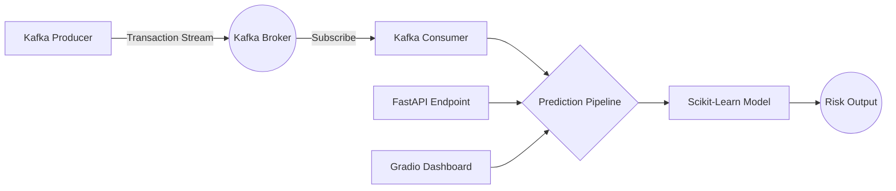

# 🛡️ Real-Time Fraud Detection MLOps System

<div align="center">
  
  
  
  
  
  
</div>

<br>

A production-ready, end-to-end Machine Learning pipeline for real-time credit card fraud detection. Built with an event-driven microservices architecture using Apache Kafka, FastAPI, and Docker, this system efficiently processes high-velocity transaction streams and serves predictions via a beautiful Gradio dashboard.

[**Launch Live Dashboard on Hugging Face Spaces 🚀**](https://huggingface.co/spaces/AbdullahKS-Devhub/fraud-detection-system)

---

## 🌟 Key Features

*   **Real-Time Streaming Inference:** Leverages Apache Kafka to ingest, process, and evaluate live financial transaction streams instantly.
*   **Highly Optimized Pipeline:** The machine learning components (`model` and `preprocessor`) are loaded into memory globally upon initialization, ensuring lightning-fast microsecond inference latency.
*   **RESTful API Integration:** Exposes a robust FastAPI endpoint (`/predict`) validated heavily by Pydantic schemas.
*   **Premium Interactive Dashboard:** Includes a sleek, dark-mode Gradio user interface for manual transaction analysis and probabilistic confidence reporting.
*   **Containerized Architecture:** Fully orchestrated using Docker and `docker-compose`, spinning up Zookeeper, Kafka brokers, consumer nodes, and the API seamlessly.
*   **MLflow Experiment Tracking:** Standardized tracking of hyperparameter tuning, metrics (ROC-AUC), and model artifacts to ensure reproducibility.

## 🏗️ Architecture



## 🛠️ Technology Stack

*   **Core:** Python 3.10, Pandas, NumPy
*   **Machine Learning:** Scikit-Learn, MLflow
*   **Streaming Engine:** Apache Kafka, Zookeeper
*   **Web Frameworks:** FastAPI, Uvicorn, Gradio
*   **Deployment:** Docker, Docker Compose, Hugging Face Spaces

## 📂 Project Structure

```text
├── src/
│   ├── api/                 # FastAPI REST application
│   ├── components/          # Data Ingestion, Transformation, & Training modules
│   ├── kafka/               # Kafka Producers and Consumers for streaming
│   └── pipeline/            # Optimized Inference & Training Pipelines
├── artifacts/               # Pickled Models and Preprocessors
├── notebooks/               # Exploratory Data Analysis (EDA)
├── docker-compose.yml       # Multi-container orchestration
├── Dockerfile               # Production container definition
├── app.py                   # Gradio Dashboard UI
└── ROADMAP.md               # Historical project logs
```

## 🚀 Getting Started

### Prerequisites
*   Docker & Docker Compose
*   Python 3.10+

### Local Execution (Docker Orchestration)
To spin up the entire event-driven architecture (Kafka, Zookeeper, API, and Consumer):
```bash
docker-compose up --build
```
*The FastAPI docs will be available at `http://localhost:8000/docs`.*

### Local Execution (Gradio Dashboard)
To run the standalone interactive UI:
```bash
pip install -r requirements.txt
python app.py
```
*The UI will launch on `http://127.0.0.1:7860`.*

## 📊 Model Performance
Given the extreme class imbalance in credit card fraud (~0.17%), models were evaluated using the **ROC-AUC** metric. 
- **Algorithms Evaluated:** Logistic Regression, Random Forest (with class weight balancing).
- **Inference Threshold:** Tuned dynamically to `0.265` using F1-score optimization for maximum recall on fraudulent cases without excessive false positives.

## 📜 Development Roadmap
To see the chronological progression of this project from Day 1 to Day 9, please refer to the [ROADMAP.md](ROADMAP.md) file.
