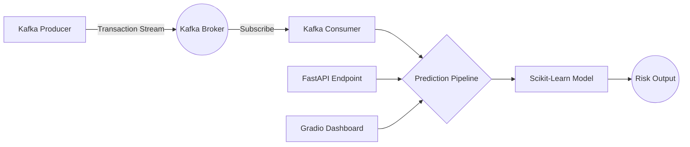

<div align="center">

# 🛡️ Fraud Detection MLOps System
### *Real-Time Security. Event-Driven Insights. Fraud Prevention.*

[](https://gradio.app/)
[](https://python.org)
[](https://huggingface.co/spaces/AbdullahKS-Devhub/fraud-detection-system)
[](https://fastapi.tiangolo.com/)
[](https://kafka.apache.org/)
[](https://docker.com/)

<br/>

> **Stream real-time transactions. Let AI assess the risk. Prevent fraud instantly.**

<br/>

🚀 **[Try the Live Demo →](https://huggingface.co/spaces/AbdullahKS-Devhub/fraud-detection-system)**

</div>

---

## ✨ Features

- 🛡️ **Instant Valuations** — Highly accurate fraud predictions based on streaming data
- 🧠 **Automated ML Pipeline** — End-to-end MLOps from data ingestion to model training
- ⚡ **Event-Driven Streaming** — Processes real-time transactions seamlessly using Apache Kafka
- 🎛️ **Dual Interfaces** — Beautiful dark-mode Gradio UI for manual checks, REST FastAPI for developers
- 📈 **Experiment Tracking** — Integrated with MLflow to continuously track model metrics (ROC-AUC) 
- 🌐 **Zero Setup for Users** — Fully deployed on Hugging Face Spaces

---

## 🛠️ Tech Stack

| Layer | Technology |
|---|---|
| **Frontend** | Gradio + Custom CSS (Premium Dark Theme) |
| **API Backend** | FastAPI + Uvicorn |
| **Event Streaming** | Apache Kafka + Zookeeper |
| **ML Models** | Scikit-learn (Random Forest, Logistic Regression) |
| **Experiment Tracking**| MLflow |
| **Data Processing** | Pandas, NumPy |
| **Deployment** | Docker, Docker Compose, Hugging Face Spaces |
| **Version Control** | Git |

---

## 🧠 How It Works



---

## 📥 Input Parameters

<details>
<summary>⚖️ <strong>Transaction Properties</strong></summary>
<br/>

| Parameter | Type | Description |
|---|---|---|
| **Time** | Numeric | Seconds elapsed between this transaction and the first transaction |
| **Amount** | Numeric | Transaction amount ($) |

</details>

<details>
<summary>📐 <strong>PCA Features</strong></summary>
<br/>

| Parameter | Type | Description |
|---|---|---|
| **V1 - V28** | Numeric | Principal components obtained via PCA to protect user confidentiality |

</details>

---

## 🚀 Run Locally

**1. Clone the repo**
```bash
git clone https://github.com/abdullahks-devhub/fraud-detection-mlops-system.git
cd fraud-detection-mlops-system
```

**2. Run with Docker Compose (Full Streaming Pipeline)**
```bash
docker-compose up --build
```
*Access the API at `http://localhost:8000/docs`*

**3. Or Run the Gradio App Independently**
```bash
pip install -r requirements.txt
python app.py
```
*The UI will launch on `http://127.0.0.1:7860`.*

---

## 📁 Project Structure

```text
.
├── notebooks/                # Exploratory Data Analysis (EDA)
│   └── eda.ipynb
├── src/                      # Source Code
│   ├── api/                  # FastAPI Application
│   │   └── app.py
│   ├── components/           # Core ML Logic
│   │   ├── data_ingestion.py
│   │   ├── data_transformation.py
│   │   └── model_trainer.py
│   ├── kafka/                # Streaming engine
│   │   ├── producer.py
│   │   └── consumer.py
│   ├── pipeline/             # Inference orchestration
│   │   └── prediction_pipeline.py
├── artifacts/                # Pickled Models and Preprocessors
├── ROADMAP.md                # Historical project logs
├── docker-compose.yml        # Multi-container setup
├── Dockerfile                # API Containerization
├── app.py                    # Gradio Web UI
└── requirements.txt          # Python dependencies
```

---

## 📊 Dataset

| Dataset | Source | Records | Features |
|---|---|---|---|
| Credit Card Fraud | Kaggle | ~284,807 | 30 predicting features, 1 target |

The dataset features extreme class imbalance (~0.17% fraud cases). Models were evaluated heavily on the **ROC-AUC** metric, and the final decision threshold was mathematically tuned dynamically to `0.265` via F1-score optimization for maximum recall on fraudulent cases without excessive false positives.

---

## ⚠️ Disclaimer

> This application is built **for educational and demonstration purposes only**.
> It is **not** a substitute for production banking or financial security systems.
> Always consult a qualified security architect before deploying fraud-detection mechanisms.

---

<div align="center">

Made with ❤️ by **[Abdullah Khan](https://github.com/abdullahks-devhub)**

⭐ Star this repo if you found it useful!

</div>
